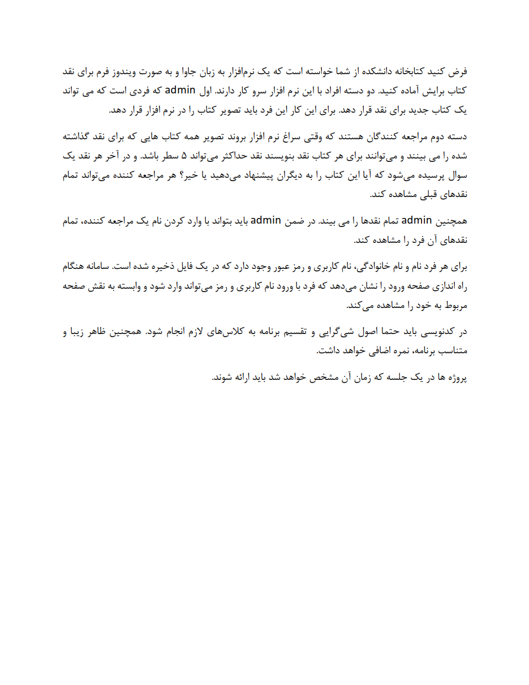

# **📚 Library Management GUI Project | پروژه مدیریت کتابخانه گرافیکی**

**A university project in which a library management system is designed using Java Swing and has user and admin parts.**

**یک پروژه دانشگاهی که در آن یک سیستم مدیریت کتابخانه با استفاده از Java Swing طراحی می‌شود و دارای قسمت‌های کاربر و ادمین است.**

# 💬 **نکات پروژه**

* عکس‌های برنامه در دایرکتوری ScreenShots قرار دارند.
* برای اجرا برنامه، به JDK 16 و یا بیشتر نیاز دارید.
* لطفا فایل UsersDB.txt در دایرکتوری Database را مطالعه کنید. (یوزر و پسوردهای مورد نیاز در آن قرار دارد)
* برای دسترسی به همه‌ی پروژه‌های دانشگاهی من، به این لینک مراجعه کنید:

👈🏻 **[پروژه‌های دانشگاهی من](https://github.com/bestmahdi2/Uni__Bachelors_SKU_Path)**

# 📝 **توضیحات پروژه**

# 🖼 **عکس‌های پروژه**

  
  
  
  
  

  

  

  

  

  

